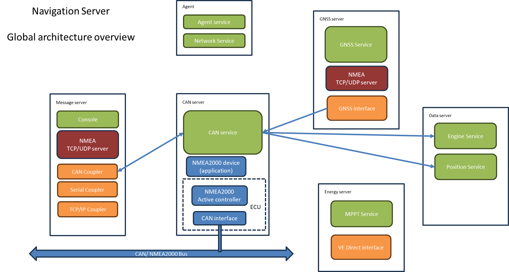

# Navigation server global architecture

## Introduction

For flexibility, reliability and distribution of the processing load multiple CPU the Navigation messaging system is spawned over multiple processes with each of them running the Python interpreter.

All these processes communicate using gRPC and implement one or more services that are exposing the interfaces for data and messages.

## Processes used in the system

### Agent server

systemd service name: navigation_agent
process internal name: navigation_agent
supported gRPC services:
- AgentService [agent.proto](../navigation_server/protobuf/agent.proto)
- NetworkService [network.proto](../navigation_server/protobuf/network.proto)

The process is the controller of all the others. It shall be launched by systemd at system boot, and it will start all other processes based on its configuration file.
The service monitors the state of the other processes and is able to trigger systemd commands on them.

It also embarks the NetworkService that controls system interfaces using NetworkManager (that service is still not complete in V2.5.1)

### CAN server

systemd service name: can_server
process internal name: STNC_CAN_Server
supported gRPC services:
- N2KCanService [n2k_can_service.proto](../navigation_server/protobuf/n2k_can_service.proto)

The process implements the complete NMEA2000/J1939 communication stack for a CAN port. It allows other processes to subscribe to NMEA2000 messages streams and to send NMEA2000 messages to the CAN bus.
It can also host specific applications that will appear as CAN devices on the bus.

### Message server

systemd service name: navigation
process internal name: STNC_Message_Server
supported gRPC services:
- Console [console.proto](../navigation_server/protobuf/console.proto)

The process implements the TCP/IP (UDP is coming) server that will distribute NM0183 od pseudo-NMEA0183 NMEA2000 encoded messages for use with other applications.
In the other direction a TCP/IP server is accepting connection to send messages towards various couplers.
To communicate with the boat instruments, directly or indirectly, the process is instantiating Coupler and Publisher objects.

The Console service allows controlling and monitoring the Couplers running inside the server

### GNSS server

systemd service name: gnss
process internal name: GNSS
supported gRPC services:
- GNSSService [gnss.proto](../navigation_server/protobuf/gnss.proto)

The process is reading the GNSS output (in NMEA0183) and holds a view of the GNSS system status that is available through the service.
It also forwards NMEA2000 GNSS messages to the CAN server for distribution of those on the CAN bus and other servers.

### Energy server

systemd service name: energy
process internal name: Energy
supported gRPC services:
- MPPTService [energy.proto](../navigation_server/protobuf/energy.proto)

The Energy server is currently (V2.5.1) restricted to MPPT output monitoring. The data is accessible through the service interface.
More to come...

### Data server

systemd service name: navigation_data
process internal name: Data
supported gRPC services:
- NavigationDataService (no gRPC interface)
- EngineDataService [engine_data.proto](../navigation_server/protobuf/engine_data.proto)

This process is holding the current state of the ship. It is currently limited to current and historical data about the engines.

